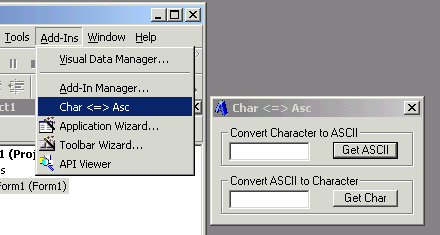



## VB 6\.0 Add\-In \- Asc/Chr Conversions

### Description

This is an extremely usefull add-in for VB 6.0 that allows you to convert ASCII to Character and Character to ASCII. Nothing complicated here, just simple code for a simple purpose.
 
### More Info
 
Just compile the .dll into the VB98 directory.

             |
---                |---
**Submitted On**   |2001-07-30 15:08:38
**By**             |[Andy T\.](https://github.com/Planet-Source-Code/PSCIndex/blob/master/ByAuthor/andy-t.md)
**Level**          |Beginner
**User Rating**    |5.0 (20 globes from 4 users)
**Compatibility**  |VB 6\.0
**Category**       |[VB function enhancement](https://github.com/Planet-Source-Code/PSCIndex/blob/master/ByCategory/vb-function-enhancement__1-25.md)
**World**          |[Visual Basic](https://github.com/Planet-Source-Code/PSCIndex/blob/master/ByWorld/visual-basic.md)
**Archive File**   |[VB 6\_0 Add237767302001\.zip](https://github.com/Planet-Source-Code/andy-t-vb-6-0-add-in-asc-chr-conversions__1-25663/archive/master.zip)

